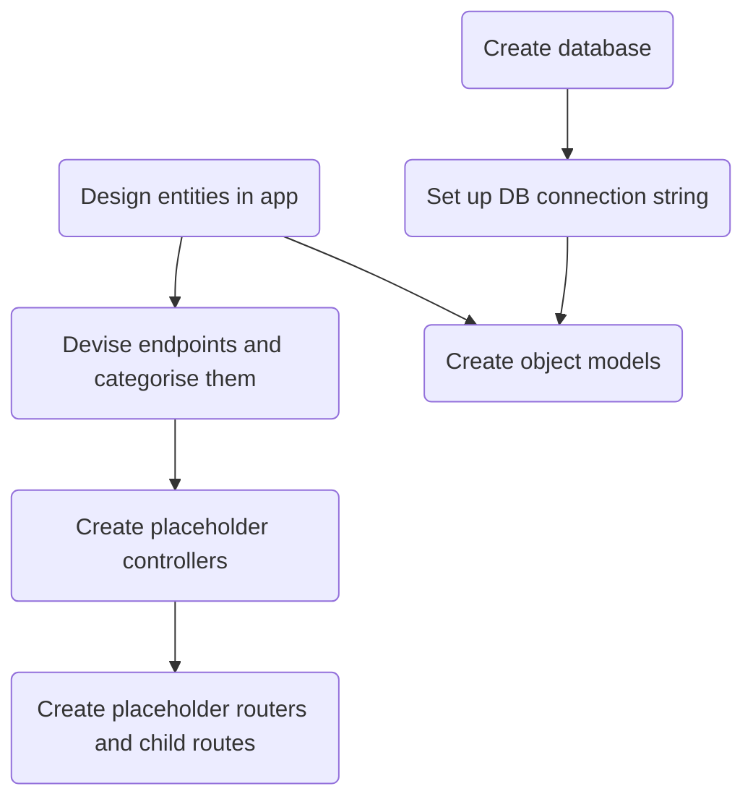

# Boilerplate Template
{: .no_toc }

1. TOC
{:toc}

## Folder Structure

```
.
├── index.ts
├── db            # Database functions: connect
├── controllers   # Functions used in routes
├── middleware    # Key functions for processing requests and returning responses
│   ├── begin-with-the-crazy-ideas. Textile
│   └── on-simplicity-in-technology. Markdown
├── models        # Object models
├── public
    ├── index.html
    └── styles.css
└── routes        # Routers for given URL prefixes
```

## `package.json`
This template is for an Express app built in TypeScript.

- Express
- Mongoose

```json
{
  "name": "project-name",
  "version": "1.0.0",
  "description": "",
  "main": "index.js",
  "scripts": {
    "build": "npx tsc",
    "start": "node dist/index.js",
    "dev": "concurrently \"npx tsc --watch\" \"nodemon -q dist/index.js\"",
    "test": "echo \"Error: no test specified\" && exit 1"
  },
  "keywords": [],
  "author": "",
  "license": "ISC",
  "dependencies": {
    "dotenv": "^16.0.3",
    "express": "^4.18.2",
    "mongoose": "^6.7.2"
  },
  "devDependencies": {
    "@types/express": "^4.17.14",
    "@types/node": "^18.11.9",
    "concurrently": "^7.5.0",
    "nodemon": "^2.0.20"
  }
}

```

## Controllers
Controllers are essentially the functions encapsulating the logic used for each route. They take a `request` and `response` object.

## Generic Workflow
1. Design the entities you'll need to manage
2. Devise the endpoints you need (think CRUD), grouping them into various route groups
3. Create placeholder controllers
4. Create placeholder routers, calling the placeholder controllers
5. Set up and test all routes in Postman
6. Create database
7. Set up DB connection string
8. Create models

