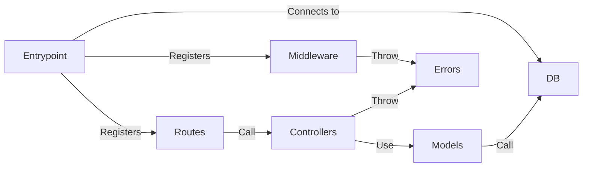

# Folder Structure
{: .no_toc }

1. TOC
{:toc}

## Overview

```
.
├── dist                    # Folder where TypeScript app is compiled
├── src
│   ├── controllers         # Functions used in routes
│   ├── db                  # Database functions: connect
│   ├── errors              # Custom errors
│   ├── middleware          # Key functions for processing requests and returning responses
│   ├── models              # Object models
│   ├── public
│   │   ├── index.html
│   │   └── styles.css
│   ├── routes              # Routers for given URL prefixes
│   ├── types               # Types to extend existing classes
│   ├── index.ts / app.ts   # Entrypoint
│   └── swagger.yaml        # Types to extend existing classes
├── .env
├── .gitignore
├── package.json
├── package-lock.json
└── tsconfig.json
```

## Relationships



## Components

### Entrypoint
The main entry point for the app. Usually called `index.ts` or `app.ts`.

- Initialises the app
- Registers [middleware](#middleware) and places them in the right order (relative to each other and the routes)
- Registers the [routes](#routes)
- Connects to the database using the function(s) from [DB](#db)
- Starts the server after successful connection to the database

### Controllers
Functions encapsulating the logic used for each route.

- Separate into several files - one per major entity
- Each function:
  - Takes a `request` and `response` object as arguments
  - Checks for errors, possibly using any custom [errors](#errors)
  - Returns a response (status + data/rendered template)
- Imports [object models](#models) for CRUD operations
- Exports controllers, which are called in [routes](#routes)

### DB
Functions to connect to databases. The functions are called in the [entrypoint](#entrypoint).

### Errors
Custom error handler class and utility to instantiate errors. Used in [controllers](#controllers).

### Middleware
Middleware functions that receive a request, process data, and call the next function, which could be more middleware or a final piece of logic.

- Separate into several files - one per category of middleware
- Each middleware function takes `request`, `response` and `next` objects/functions as arguments, and either (1) calls `next()` or (2) returns a final response
- Exports middleware functions, which are called in the [entrypoint](#entrypoint)

Example of middleware:

- Handler for routes that are not found:
  - Registered after all other routes
  - Returns an error
- Wrapper to make controllers asynchronous
- Custom error handler

### Models
Object models for all entities in separate files:

- Defines schemas, including any validators
- Defines models using respective schemas
- Exports the models, which are called in [controllers](#controllers)

### Public
WIP

### Routes
Imports associated controllers for logic at each endpoint.

- Defined by URI prefix (e.g. `/api/v1/people` is `/` and `api/v1/people/:id` is `:id`)
- Routes are defined in chains (e.g. `router.route('/').get(<controller 1>).post(<controller 2>`)
- Routes are uniquely defined by URI prefix and HTTP method
- Logic is taken from [controllers](#controllers)
- Exports routers, which are called in the [entrypoint](#entrypoint)