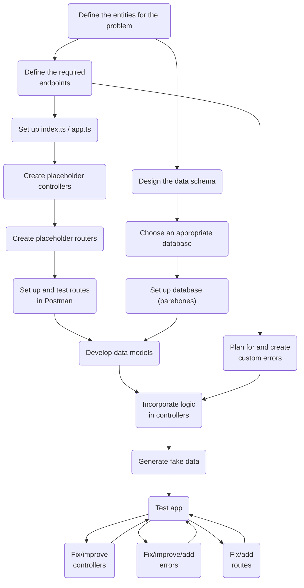

# Generic Workflow (WIP)
{: .no_toc }

This is a living document for the workflow I have extrapolated from the courses I've done on NodeJS + Express. I will update this from time to time as I gain more experience in backend development.

1. TOC
{:toc}

## Flowchart

### Define the entities for the problem
Do this based on your understanding of the business problem, process and the entities involved.

### Define the required endpoints
If you're building a REST API, it's typically CRUD - Create, Read, Update, and Delete.

### Design the data schema
- Identify the attributes on each entity
- Identify relationships among the entities
- Decide whether **transactions** are necessary - affects whether you go for SQL or NoSQL

### Choose an appropriate database
Most likely PostgreSQL or MongoDB. But, there may be other database you require, like Redis as a cache, or blob storage for files.

### Set up database
Get an instance running, set up credentials, and get the connection string.

### Set up `index.ts` / `app.ts`
Set up the entrypoint with basic functionality, including placeholders for any functionality that is yet to be developed:

- Environment variables
- Middleware
  - JSON
  - Static
  - Security plugins
- Routes:
  - Home
  - Error handler
  - Not found
- Start server

### Create placeholder controllers
Simple async functions that return a message saying what that controller does.

### Create placeholder routes
Set up routes (as part of routers) for each entity, with the correct path and HTTP verb, and that call the correct controller.

### Set up and test routes in Postman
Create new workspace and add all routes to it with sensible examples. If you need to use examples, don't hard-code them into the URLs. Also, set up global variables where required.

### Develop data models
If you chose PostgreSQL, it's an object-relational mapping (ORM) like Sequelize. If you chose MongoDB, it's an object-document mapper like Mongoose.

### Plan for and create custom errors
You can anticipate what kinds of errors you will get. There's the generic `BadRequestError` for any poorly-formed requests. If there's authentication, there will surely be a need for an `UnauthenticatedError`.

### Incorporate logic in controllers
Give your controllers some real functionality by putting some logic in: primarily interactions with the database and handling for any errors that you can foresee.

### Generate fake data
You'll need it for the next step.

### Test app
I'm still learning how to do this.

