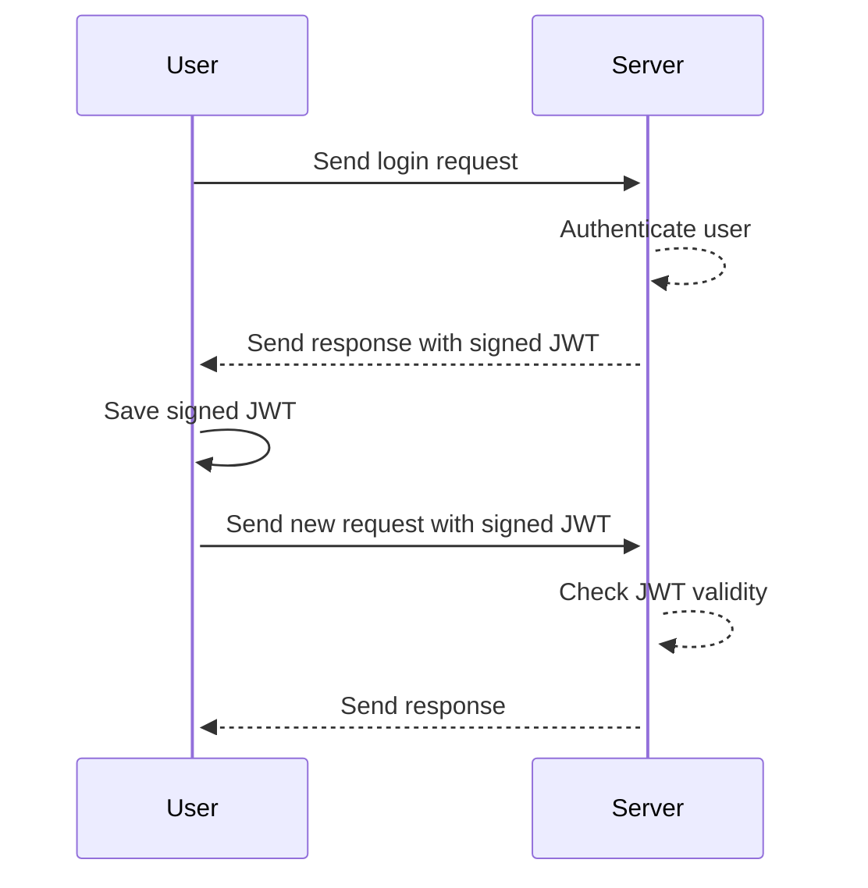

# JSON Web Tokens
{: .no_toc }

1. TOC
{:toc}

## Introduction
JSON Web Tokens (JWTs) enable the server to remember who the user is **after authentication**. How it works:



## Components
There are 3 components in a JWT string:

1. Payload
2. Header
3. Signature

### Payload
The payload contains information about the user. It is only base64-encoded, and is **accessible to everyone** who can see the token. Therefore, just enough info is contained to allow the server to identify the user.

### Header
This is an object containing (1) the algorithm for encrypting the payload and header and (2) the type of token (in this case, a JWT). It is also base64-encoded.

### Signature
This is a string generated by the server by encrypting the base64-encoded payload and header, like so:

```
HMACSHA256(
  base64UrlEncode(header) + "." +
  base64UrlEncode(payload),
  secret
)
```

The secret is stored on the server, and is only used when encrypting or decrypting the token.

## Verifying JWTs
To check for a JWT's validity, the server does the following:

1. Base64-decode the header
2. Base64-decode the payload
3. Check the expiry timestamp in the payload
4. Use the secret to compute the signature by hashing the base64-encoded header and payload
5. Compare the computed signature against the provided signature

## Best Practices
1. **Never store confidential information in a JWT.** Store just enough info for the server to know who the user is.
2. **Always use HTTPS**, because JWTs are accessible by anyone.
3. **Use JWTs in conjunction with other processes for authentication.** You kinda have to, since JWTs are only issued *after authentication*.
4. **Always set token expiries.**